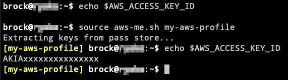

# aws-me

Set/unset AWS profile credentials in a bash shell environment

By default, this script will retrieve AWS credentials stored in a [Pass](https://www.passwordstore.org/) store provided that they follow the following structure:

```
$ pass
Password Store
└── AWS
    ├── someprofile
    │   ├── aws_access_key_id
    │   └── aws_secret_access_key
    └── anotherprofile
        ├── aws_access_key_id
        └── aws_secret_access_key
```

Alternatively, you can retrieve AWS credentials from a credentials file. To enable this, set an `USE_AWS_CREDENTIALS_FILE` environment variable to the absolute path where your AWS credentials file is located.

```
$ export USE_AWS_CREDENTIALS_FILE='/Users/somebody/.aws/credentials'
```

**NOTE:** This script has only been tested in Bash 5.0.x on Mac OS.

## Usage

```
Usage: awsme.sh [-u|--unset] [PROFILE]

 -u, --unset  (optional) Unset all AWS-related ENVVARs
 PROFILE      (optional) Set ENVVARs for PROFILE

Retrieves credentials stored in a Pass store by default. To use
an AWS credentials file, set the USE_AWS_CREDENTIALS_FILE
environment variable to the absolute path where the file is
located.

If no arguments are given, lists all profiles defined in the
pass store or credentials file.
```

You'll want to run this in conjunction with `source` to make the changes stick in the current shell.


